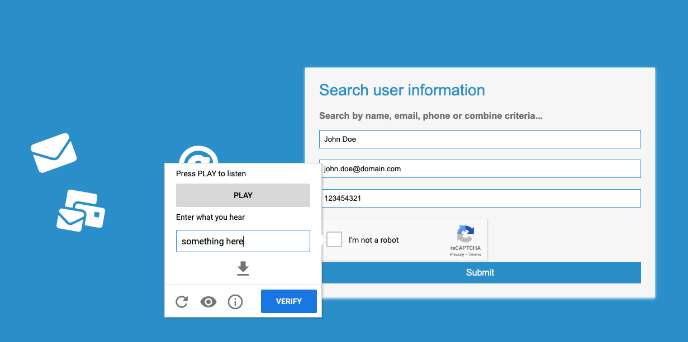
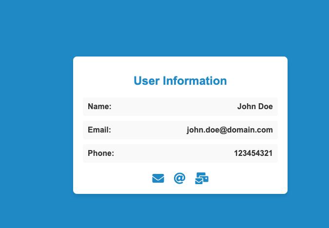

# Solving reCaptcha with Code

### Package used for this reCaptcha solver Selenium reCaptcha Solver [selenium-recaptcha-solver](https://pypi.org/project/selenium-recaptcha-solver/).

#### This is a demo on how to run a reCaptcha Solver using Python3 Selenium and selenium-recaptcha-solver 1.9.0 package

### Presentation

[Solving reCaptcha with Code - Presentation](https://docs.google.com/presentation/d/1EVZq1njnrB15p6CjDqNggVFr2vFFafde9WDpkv4oKZo/edit?usp=sharing)

## Repository

[GitHub Repository](https://github.com/pablothx-caylent/captcha-solver)

## How to run this example

### Step 1: Download the Repository

Download the repository from [GitHub](https://github.com/pablothx-caylent/captcha-solver).

### Step 2: Install Docker, Python and dependencies in a virtual environment

Check the installation steps [Docker](https://docs.docker.com/desktop/install/mac-install/)

```sh
brew install python

brew install pyenv

python3 -m venv myenv

source myenv/bin/activate
```

### Install the necessary dependencies

```sh
pip install -r requirements.txt
```

### Step 3: Build and Run the Docker Container

To set up the environment, build and run the Docker container with the following commands:

```sh
docker build -t captcha-nginx .
docker run --rm -p 80:80 --name captcha-nginx-container captcha-nginx
```

### Step 4: Run the Script

Once the Docker container is running, you can run the script with the following command:

```sh
python3 captcha.py
```

#### You will see how chrome starts and uses the Selenium-recaptcha-solver package to solve ReCAPTCHA challenges.

#### First image you see is when selenium opens the URL


#### Then you can see how it starts resolving the recaptcha challenge




#### Finally it will click on submit and redirect you to to success page.


